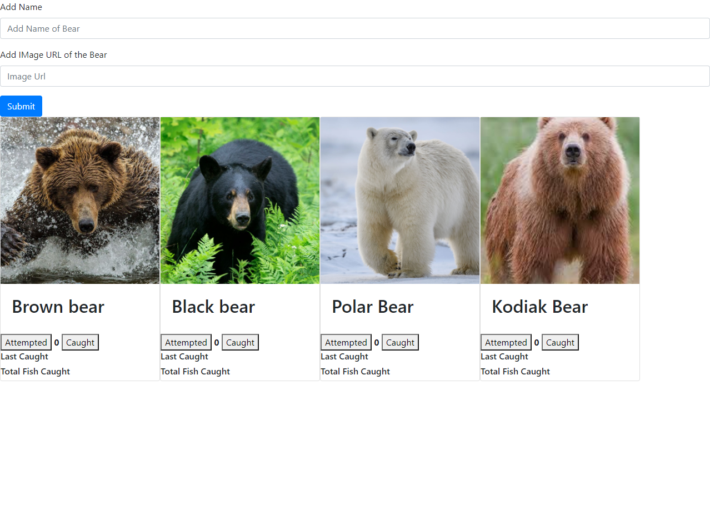

# bear-watcher

The Bear Watcher project is a fictional bear tracking site designed to allow a user to upload a photo and name of a bear they saw in a river. It also includes buttons to track if a bear has attempted to, or caught a fish, and gives a time stamp.

#Technology Used

HTML
CSS
Javascript
JQuery
